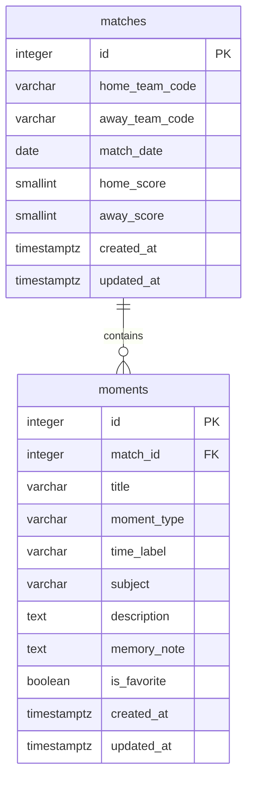

# Football Moment Archive データ設計

## 1. 文書概要

### 1.1 目的

本書は、`football-moment-archive` で扱うデータ、テーブル構成、カラム、制約、検索条件、マイグレーションおよびシードデータの管理方針を定義するための文書である。  
本書は開発中のデータ設計に関する判断基準として使用する。  
実装完了後は、完成した仕様と実装内容を反映した設計書を別途作成する。

### 1.2 対象範囲

本書では、次の内容を対象とする。

- アプリで扱うデータ
- テーブル間の関係
- カラムと PostgreSQL の型
- `NULL` の扱い
- `CHECK` 制約と外部キー
- 固定値の管理
- 登録件数上限
- インデックス
- 検索・絞り込み・並び替え・ページネーション
- マイグレーションとシードデータ

画面構成、Server Component、Server Action、Data Access Layer の責務と配置は、別途 `screen-design.md` および `architecture.md` で定義する。

## 2. データ設計方針

- PostgreSQL を使用する
- ORM は使用しない
- DB のテーブル名とカラム名は `snake_case` とする
- TypeScript の型とプロパティ名は `PascalCase` および `camelCase` とする
- アプリの中心データは「場面」とする
- 日本語の UI とドキュメントでは「場面」、プログラム上では `Moment`、`moment`、`moments` を使用する
- 試合は場面が発生した背景情報として扱う
- DB テーブルは `matches` と `moments` の 2 テーブルとする
- チーム、リーグ、シーズン、場面の種類はマスターテーブル化しない
- 公式試合データや外部サッカー API との照合は行わない
- 登録件数が少ないため、全文検索や複雑なインデックスは導入しない
- テーブル作成・変更とシードデータは SQL ファイルで管理する
- アプリから実行する SQL は Data Access Layer の TypeScript ファイルに記述する

## 3. データモデル

### 3.1 テーブル構成



### 3.2 関係

- 1 試合は 0 件以上の場面を持つ
- 1 場面は必ず 1 試合に属する
- 場面が存在しない試合も登録可能とする
- 試合を登録せずに場面だけを登録することはできない

## 4. 固定データ

### 4.1 対象リーグ・シーズン

対象リーグとシーズンは、各試合レコードには保存せず、アプリの固定設定として管理する。

| 項目     | 値             |
| -------- | -------------- |
| リーグ   | Premier League |
| シーズン | 2025/26        |
| 開始日   | 2025-08-16     |
| 終了日   | 2026-05-24     |

TypeScript では、次のような定数として管理する。

```ts
export const TARGET_COMPETITION = {
  league: 'Premier League',
  season: '2025/26',
  startDate: '2025-08-16',
  endDate: '2026-05-24',
} as const;
```

### 4.2 対象チーム

2025/26 シーズンにプレミアリーグへ所属した 20 チームを固定値として管理する。  
利用者によるチームの追加・編集・削除は行わない。

| チームコード               | 表示名                  |
| -------------------------- | ----------------------- |
| `arsenal`                  | Arsenal                 |
| `aston-villa`              | Aston Villa             |
| `afc-bournemouth`          | AFC Bournemouth         |
| `brentford`                | Brentford               |
| `brighton-and-hove-albion` | Brighton & Hove Albion  |
| `burnley`                  | Burnley                 |
| `chelsea`                  | Chelsea                 |
| `crystal-palace`           | Crystal Palace          |
| `everton`                  | Everton                 |
| `fulham`                   | Fulham                  |
| `leeds-united`             | Leeds United            |
| `liverpool`                | Liverpool               |
| `manchester-city`          | Manchester City         |
| `manchester-united`        | Manchester United       |
| `newcastle-united`         | Newcastle United        |
| `nottingham-forest`        | Nottingham Forest       |
| `sunderland`               | Sunderland              |
| `tottenham-hotspur`        | Tottenham Hotspur       |
| `west-ham-united`          | West Ham United         |
| `wolverhampton-wanderers`  | Wolverhampton Wanderers |

DB には表示名ではなくチームコードを保存する。  
画面表示時は、TypeScript の固定値からチームコードに対応する表示名を取得する。

### 4.3 場面の種類

場面の種類は、次の固定値として管理する。

| 保存値     | 表示名       |
| ---------- | ------------ |
| `goal`     | ゴール       |
| `save`     | セーブ       |
| `pass`     | パス         |
| `dribble`  | ドリブル     |
| `defense`  | 守備         |
| `tactical` | 戦術・交代   |
| `decision` | 判定         |
| `reaction` | 反応・雰囲気 |
| `other`    | その他       |

場面の種類は利用者による追加・編集・削除を行わない。  
Server Action の入力値検証と DB の `CHECK` 制約の両方で許可値を検証する。

## 5. `matches` テーブル

### 5.1 役割

場面が発生した試合の背景情報を保持する。  
リーグ、シーズン、会場、スタッツなどは保持せず、場面を識別するために必要な情報だけを扱う。

### 5.2 カラム定義

| カラム           | PostgreSQL の型 | `NULL` | 初期値              | 内容                       |
| ---------------- | --------------- | -----: | ------------------- | -------------------------- |
| `id`             | `INTEGER`       |   不可 | 自動採番            | 試合 ID                    |
| `home_team_code` | `VARCHAR(32)`   |   不可 | なし                | ホームチームの固定コード   |
| `away_team_code` | `VARCHAR(32)`   |   不可 | なし                | アウェーチームの固定コード |
| `match_date`     | `DATE`          |     可 | `NULL`              | 試合日                     |
| `home_score`     | `SMALLINT`      |     可 | `NULL`              | ホームチームの得点         |
| `away_score`     | `SMALLINT`      |     可 | `NULL`              | アウェーチームの得点       |
| `created_at`     | `TIMESTAMPTZ`   |   不可 | `CURRENT_TIMESTAMP` | 登録日時                   |
| `updated_at`     | `TIMESTAMPTZ`   |   不可 | `CURRENT_TIMESTAMP` | 更新日時                   |

### 5.3 主キー

`id` は、PostgreSQL の Identity Column を使用した自動採番とする。

```sql
id INTEGER GENERATED ALWAYS AS IDENTITY PRIMARY KEY
```

UUID は使用しない。  
登録件数が少なく、公開 ID を推測されても問題がなく、URL と SQL の可読性を優先する。

### 5.4 チーム制約

`home_team_code` と `away_team_code` は、固定 20 チームのコードだけを許可する。  
Server Action で検証したうえで、DB の `CHECK` 制約でも許可値を制限する。

ホームとアウェーに同じチームを指定することはできない。

```sql
CHECK (home_team_code <> away_team_code)
```

### 5.5 試合日制約

`match_date` は任意とする。  
入力される場合は、2025/26 シーズンの期間内だけを許可する。

```sql
CHECK (
  match_date IS NULL
  OR match_date BETWEEN DATE '2025-08-16' AND DATE '2026-05-24'
)
```

実際の公式日程との一致は検証しない。

### 5.6 スコア制約

スコアは、ホームとアウェーの両方を入力するか、両方を未入力とする。  
片方だけの入力は許可しない。

```sql
CHECK (
  (home_score IS NULL AND away_score IS NULL)
  OR
  (home_score IS NOT NULL AND away_score IS NOT NULL)
)
```

得点は 0 以上の整数とする。

```sql
CHECK (home_score IS NULL OR home_score >= 0)
CHECK (away_score IS NULL OR away_score >= 0)
```

### 5.7 重複データ

同じチーム、試合日、スコアを持つ試合が複数登録されることを許容する。  
重複を防止する `UNIQUE` 制約は設定しない。

公式試合マスターを保持せず、利用者の入力内容を公式データと照合しない要件と整合させる。

## 6. `moments` テーブル

### 6.1 役割

試合の中で記録しておきたい場面を保持する。  
アプリの中心となるテーブルであり、必ず 1 件の試合に関連付ける。

### 6.2 カラム定義

| カラム        | PostgreSQL の型 | `NULL` | 初期値              | 内容                 |
| ------------- | --------------- | -----: | ------------------- | -------------------- |
| `id`          | `INTEGER`       |   不可 | 自動採番            | 場面 ID              |
| `match_id`    | `INTEGER`       |   不可 | なし                | 関連する試合 ID      |
| `title`       | `VARCHAR(80)`   |   不可 | なし                | 場面のタイトル       |
| `moment_type` | `VARCHAR(32)`   |   不可 | なし                | 場面の種類           |
| `time_label`  | `VARCHAR(30)`   |     可 | `NULL`              | 発生時間・タイミング |
| `subject`     | `VARCHAR(100)`  |     可 | `NULL`              | 場面の対象           |
| `description` | `TEXT`          |     可 | `NULL`              | 何が起きたか         |
| `memory_note` | `TEXT`          |     可 | `NULL`              | なぜ印象に残ったか   |
| `is_favorite` | `BOOLEAN`       |   不可 | `FALSE`             | お気に入り状態       |
| `created_at`  | `TIMESTAMPTZ`   |   不可 | `CURRENT_TIMESTAMP` | 登録日時             |
| `updated_at`  | `TIMESTAMPTZ`   |   不可 | `CURRENT_TIMESTAMP` | 更新日時             |

### 6.3 主キー

`id` は、`matches.id` と同様に Identity Column を使用した自動採番とする。

```sql
id INTEGER GENERATED ALWAYS AS IDENTITY PRIMARY KEY
```

### 6.4 関連試合

`match_id` は必須とし、`matches.id` を参照する外部キーを設定する。

```sql
FOREIGN KEY (match_id)
REFERENCES matches(id)
ON DELETE RESTRICT
```

存在しない試合 ID を持つ場面は登録できない。

### 6.5 タイトル

`title` は必須とする。

- 前後の空白を除いた状態で 1 文字以上
- 最大 80 文字
- 空白だけの値は不可

```sql
CHECK (
  CHAR_LENGTH(BTRIM(title)) BETWEEN 1 AND 80
)
```

### 6.6 場面の種類

`moment_type` は必須とし、4.3 で定義した固定値だけを許可する。  
不正な値は Server Action と DB の `CHECK` 制約で拒否する。

### 6.7 発生時間

`time_label` は自由入力の任意項目とする。

入力例：

- `23分`
- `45+2分`
- `後半開始直後`
- `延長後半`
- `PK戦`
- `試合終了後`

数値としての並び替えや公式試合時間との照合は行わない。

- 最大 30 文字
- 未入力は `NULL`
- 空白だけの値は `NULL` へ変換

### 6.8 対象

`subject` は、場面の中心となった人物、チーム、集団などを入力する任意項目とする。

入力例：

- 選手名
- 監督名
- チーム名
- 主審
- ホームサポーター
- アウェーサポーター

- 最大 100 文字
- 未入力は `NULL`
- 空白だけの値は `NULL` へ変換

### 6.9 何が起きたか

`description` は任意項目とする。

- 最大 1,000 文字
- 未入力は `NULL`
- 空白だけの値は `NULL` へ変換

### 6.10 なぜ印象に残ったか

`memory_note` は任意項目とする。

- 最大 1,000 文字
- 未入力は `NULL`
- 空白だけの値は `NULL` へ変換

`description` と `memory_note` は、両方とも未入力で登録可能とする。

### 6.11 お気に入り

`is_favorite` は `BOOLEAN` とし、必ず `TRUE` または `FALSE` を保持する。

```sql
is_favorite BOOLEAN NOT NULL DEFAULT FALSE
```

未選択時は `FALSE` とし、`NULL` は使用しない。

## 7. 外部キーと削除方針

### 7.1 試合削除

関連する場面が 1 件以上存在する試合は削除できない。

```text
関連する場面が 0 件
→ 試合を削除可能

関連する場面が 1 件以上
→ 試合を削除不可
```

アプリ側で関連件数を確認して利用者向けのエラーを返す。  
DB 側でも `ON DELETE RESTRICT` により削除を拒否する。

### 7.2 場面削除

場面は単独で削除可能とする。  
場面を削除しても、関連する試合は削除しない。

試合に関連する最後の場面を削除した場合も、試合データは保持する。

### 7.3 カスケード削除

`ON DELETE CASCADE` は使用しない。  
公開デモで誰でも削除できるため、試合削除によって複数の場面が一括削除される構成を避ける。

## 8. 登録件数上限

### 8.1 上限値

| データ | 最大件数 |
| ------ | -------: |
| 試合   |    50 件 |
| 場面   |   100 件 |

上限値は、TypeScript の固定値として管理する。

```ts
export const DATA_LIMITS = {
  matches: 50,
  moments: 100,
} as const;
```

### 8.2 上限判定

新規登録処理の直前に、Data Access Layer で現在件数を取得する。

```text
現在件数が上限未満
→ 登録可能

現在件数が上限以上
→ 登録を拒否
```

上限到達後も、既存データの編集と削除は可能とする。  
データを削除して上限未満になった場合は、再び新規登録できる。

### 8.3 DB 制約

テーブル全体の行数上限は、通常の `CHECK` 制約では管理しない。  
Server Action から利用者向けのエラーを返し、Data Access Layer で件数確認と登録を行う。

同時リクエストによって上限をわずかに超える可能性は許容する。  
厳密な排他制御、専用カウンターテーブル、DB ロックは導入しない。

## 9. `NULL` と空文字の扱い

### 9.1 基本方針

未入力の任意項目は、空文字ではなく `NULL` として保存する。  
Server Action の入力値検証時に前後の空白を除去し、空文字になった値を `NULL` へ変換する。

### 9.2 `NULL` を許可する項目

#### `matches`

- `match_date`
- `home_score`
- `away_score`

#### `moments`

- `time_label`
- `subject`
- `description`
- `memory_note`

### 9.3 `NULL` を許可しない項目

#### `matches`

- `id`
- `home_team_code`
- `away_team_code`
- `created_at`
- `updated_at`

#### `moments`

- `id`
- `match_id`
- `title`
- `moment_type`
- `is_favorite`
- `created_at`
- `updated_at`

## 10. 登録日時・更新日時

`created_at` は登録日時を保持し、登録後は変更しない。  
`updated_at` はデータを更新するたびに `CURRENT_TIMESTAMP` へ更新する。

DB トリガーは使用せず、Data Access Layer の更新 SQL で明示的に更新する。

```sql
UPDATE moments
SET
  title = ${title},
  updated_at = CURRENT_TIMESTAMP
WHERE id = ${id};
```

お気に入り状態の切り替えも更新として扱い、`updated_at` を変更する。

## 11. インデックス

### 11.1 基本方針

登録上限が試合 50 件、場面 100 件であるため、性能上は多数のインデックスを必要としない。  
外部キー、絞り込み、並び替えで使用するカラムに最低限のインデックスを設定する。

### 11.2 `matches`

次のカラムにインデックスを設定する。

- `home_team_code`
- `away_team_code`
- `match_date`
- `created_at`

### 11.3 `moments`

次のカラムにインデックスを設定する。

- `match_id`
- `moment_type`
- `created_at`

### 11.4 設定しないインデックス

次のカラムには専用インデックスを設定しない。

- `is_favorite`
- `title`
- `subject`
- `description`
- `memory_note`

`is_favorite` は値の種類が少なく、対象件数も少ない。  
キーワード検索は最大 100 件に対する `ILIKE` で十分とし、全文検索、`pg_trgm`、外部検索エンジンは導入しない。

## 12. 一覧取得

### 12.1 試合一覧

#### チーム絞り込み

選択したチームがホームまたはアウェーに含まれる試合を取得する。

```sql
WHERE
  home_team_code = ${teamCode}
  OR away_team_code = ${teamCode}
```

ホームとアウェーを分けた絞り込みは行わない。

#### 並び替え

次の 4 種類を提供する。

- 試合日の新しい順
- 試合日の古い順
- 登録日時の新しい順
- 登録日時の古い順

試合日順では、`match_date` が `NULL` のデータを昇順・降順のどちらでも末尾にする。  
同じ値を持つデータの並び順を安定させるため、`created_at` と `id` を補助条件として使用する。

```sql
ORDER BY
  match_date DESC NULLS LAST,
  created_at DESC,
  id DESC
```

#### 場面数

各試合に関連する場面数を取得して一覧へ表示する。  
`moments` を集計し、場面が存在しない試合は 0 件として扱う。

### 12.2 場面一覧

#### キーワード検索

次のカラムを `ILIKE` による部分一致検索の対象とする。

- `title`
- `subject`
- `description`
- `memory_note`

チーム名はキーワード検索の対象に含めない。

#### チーム絞り込み

`matches` を `JOIN` し、選択したチームが関連試合のホームまたはアウェーに含まれる場面を取得する。

```sql
WHERE
  matches.home_team_code = ${teamCode}
  OR matches.away_team_code = ${teamCode}
```

#### その他の絞り込み

- `moment_type`
- `is_favorite = TRUE`

#### 並び替え

次の 4 種類を提供する。

- 試合日の新しい順
- 試合日の古い順
- 登録日時の新しい順
- 登録日時の古い順

試合日順では、関連する `matches.match_date` を使用する。  
試合日が同じ場面は、場面の `created_at` と `id` を補助条件として使用する。

## 13. ページネーション

試合一覧と場面一覧は、1 ページ 10 件とする。

```ts
export const ITEMS_PER_PAGE = 10;
```

SQL では `LIMIT` と `OFFSET` を使用する。

```text
OFFSET = (ページ番号 - 1) × 10
LIMIT = 10
```

一覧取得時は、次の 2 種類の SQL を実行する。

1. 条件に一致する総件数の取得
2. 現在ページに表示するデータの取得

総ページ数は、総件数を 10 で割った値を切り上げて算出する。  
検索、絞り込み、並び替え、ページ番号は DB に保存せず、URL 検索パラメーターから受け取る。

## 14. ホーム画面用集計

ホーム画面では、次のデータを表示時に取得する。

- 試合総数
- 場面総数
- お気に入り場面数
- 最近登録された場面 5 件

集計結果を保存する専用テーブルは作成しない。  
`COUNT` と並び替えを使用して、表示時に取得する。

## 15. DB 行と TypeScript の型

### 15.1 命名変換

DB から取得した行は `snake_case` で受け取り、Data Access Layer でアプリ用の `camelCase` へ変換する。

```text
DB
moment_type
memory_note
is_favorite

TypeScript
momentType
memoryNote
isFavorite
```

### 15.2 DB 行の型

DB 行の型は、Data Access Layer の各ファイル内に定義する。

```ts
type MomentRow = {
  id: number;
  match_id: number;
  title: string;
  moment_type: string;
  time_label: string | null;
  subject: string | null;
  description: string | null;
  memory_note: string | null;
  is_favorite: boolean;
  created_at: Date;
  updated_at: Date;
};
```

### 15.3 アプリ用の型

画面とコンポーネントで使用する型は、`src/types` 配下に定義する。

```text
src/types/
├─ match.ts
└─ moment.ts
```

一覧や詳細で試合情報を含む場面を扱う場合は、`MomentWithMatch` などの型を定義する。

## 16. マイグレーション

### 16.1 管理方法

マイグレーションライブラリは使用せず、SQL ファイルで管理する。

```text
database/
├─ migrations/
│  └─ 001_create_tables.sql
├─ seeds/
│  └─ development.sql
└─ README.md
```

### 16.2 初期マイグレーション

`001_create_tables.sql` には、次の内容を含める。

- `matches` テーブルの作成
- `moments` テーブルの作成
- 主キー
- `CHECK` 制約
- 外部キー
- インデックス

テーブルの作成順は、参照元となる `matches`、参照先となる `moments` の順とする。

### 16.3 適用方法

SQL ファイルは Neon の SQL Editor などから手動で実行する。  
自動マイグレーション、独自のマイグレーション実行ツール、ORM のマイグレーション機能は使用しない。

## 17. シードデータ

### 17.1 目的

シードデータは、次の目的で使用する。

- ローカル開発時の表示確認
- 検索・絞り込み・並び替えの確認
- 任意項目の有無による表示確認
- お気に入り表示の確認
- 公開デモの初期データ復旧

### 17.2 内容

シードデータには、次の種類を含める。

- 試合日とスコアが入力された試合
- 試合日が `NULL` の試合
- スコアが `NULL` の試合
- 複数の場面を持つ試合
- 場面を持たない試合
- 各種 `moment_type` の場面
- お気に入りの場面
- 任意項目がすべて入力された場面
- 任意項目が一部またはすべて `NULL` の場面

### 17.3 再投入

公開デモのデータが編集・削除された場合は、必要に応じてシード SQL を再実行する。  
自動バックアップ、管理画面、復旧専用 API は実装しない。

## 18. データ設計上の対象外

次のデータと機能は、本設計の対象外とする。

- ユーザー
- 認証情報
- 管理者権限
- データ所有者
- チームマスター
- 選手マスター
- リーグマスター
- シーズンマスター
- 大会マスター
- 公式試合マスター
- 試合会場
- 監督
- フォーメーション
- スターティングメンバー
- 選手交代一覧
- 試合スタッツ
- タグ
- コメント
- 画像
- 動画
- 通知
- 操作履歴
- 監査ログ
- 論理削除
- 自動バックアップ
- 全文検索用の専用構成

## 19. 確定事項

- DB テーブルは `matches` と `moments` の 2 テーブルとする
- チームは固定 20 チームとし、DB にはチームコードを保存する
- リーグとシーズンはアプリの固定設定とし、各試合には保存しない
- 試合と場面は 1 対多とする
- ID は `INTEGER` の自動採番とする
- 試合日は任意とし、入力時は対象シーズン内に制限する
- スコアは両方入力または両方未入力とする
- 場面のタイトルと種類は必須とする
- 場面の発生時間、対象、説明、印象に残った理由は任意とする
- 任意文字列の未入力は `NULL` として保存する
- 関連する場面が存在する試合は削除できない
- 試合 50 件、場面 100 件の上限はアプリ側で管理する
- 一覧は `ILIKE`、`JOIN`、`ORDER BY`、`LIMIT`、`OFFSET` を使用して取得する
- 複雑な検索機構、トリガー、カスケード削除、ORM は使用しない
- マイグレーションとシードデータは SQL ファイルで管理する
