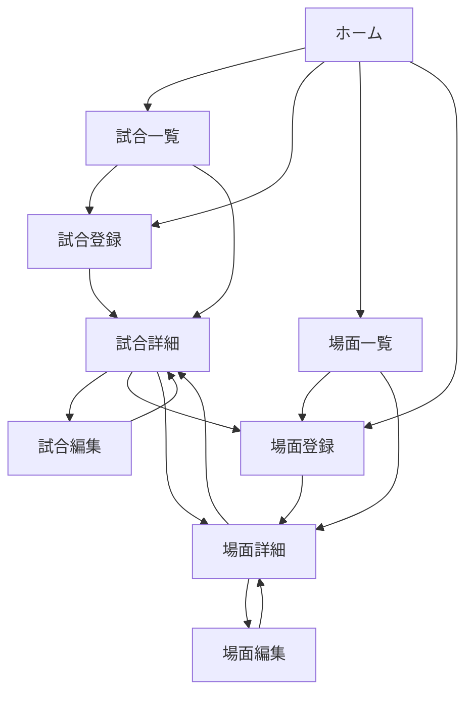

# Football Moment Archive 画面設計

## 1. 文書概要

### 1.1 目的

本書は、 `football-moment-archive` の画面構成、表示内容、操作、画面遷移、状態表示、レスポンシブ対応を定義するための文書である。  
本書は開発中の画面設計に関する判断基準として使用する。  
実装完了後は、完成した仕様と実装内容を反映した設計書を別途作成する。

### 1.2 対象範囲

本書では、次の内容を対象とする。

- 画面一覧と URL
- 共通レイアウト
- 各画面の表示内容
- 各画面で提供する操作
- 画面遷移
- フォーム項目
- 検索・絞り込み・並び替え・ページネーション
- 空状態、ローディング、エラー、404
- レスポンシブ対応
- アクセシビリティ
- Metadata

DB のテーブル、カラム、制約は `data-design.md` で定義する。  
コンポーネント構成、Server Component、Server Action、Data Access Layer の責務は `architecture.md` で定義する。

## 2. 画面設計方針

- アプリの中心となる情報は「場面」とする
- 試合は場面が発生した背景情報として扱う
- 一覧、詳細、登録、編集を明確に分ける
- 試合を先に登録し、その試合へ場面を関連付ける
- 試合と場面を同じフォームで同時登録しない
- Server Component を基本とし、操作に必要な範囲だけ Client Component を使用する
- 一覧条件は URL 検索パラメーターで管理する
- 検索・絞り込み条件は「適用」操作で反映する
- 入力エラーはフォーム内へ表示する
- 任意項目が未入力の場合は、詳細画面で項目自体を表示しない
- PC とスマートフォンの両方で基本操作を可能とする
- UI ライブラリを使用せず、Tailwind CSS で画面を構成する
- 公開デモであることと、個人情報を入力しないことを画面上で案内する

## 3. 画面一覧

| 画面 ID         | 画面名   | URL                  | 主な目的                           |
| --------------- | -------- | -------------------- | ---------------------------------- |
| `HOME`          | ホーム   | `/`                  | アプリ概要と登録状況の表示         |
| `MATCH_LIST`    | 試合一覧 | `/matches`           | 試合の検索・閲覧                   |
| `MATCH_NEW`     | 試合登録 | `/matches/new`       | 新しい試合の登録                   |
| `MATCH_DETAIL`  | 試合詳細 | `/matches/[id]`      | 試合情報と関連する場面の表示       |
| `MATCH_EDIT`    | 試合編集 | `/matches/[id]/edit` | 登録済み試合の編集                 |
| `MOMENT_LIST`   | 場面一覧 | `/moments`           | 場面の検索・閲覧                   |
| `MOMENT_NEW`    | 場面登録 | `/moments/new`       | 新しい場面の登録                   |
| `MOMENT_DETAIL` | 場面詳細 | `/moments/[id]`      | 場面の全情報の表示                 |
| `MOMENT_EDIT`   | 場面編集 | `/moments/[id]/edit` | 登録済み場面の編集                 |
| `NOT_FOUND`     | 404      | 該当なし             | 存在しないページまたはデータの案内 |
| `ERROR`         | エラー   | 該当なし             | 予期しないエラーの案内             |

## 4. 共通レイアウト

### 4.1 画面構成

すべての画面は、次の共通構成を基本とする。

```text
ヘッダー
  ├─ アプリ名
  └─ グローバルナビゲーション

メインコンテンツ
  ├─ ページタイトル
  ├─ ページ説明または補足
  ├─ 主要操作
  └─ 画面固有の内容

公開デモの案内
```

フッターは必須としない。  
公開デモの案内は、共通レイアウト内で利用者が確認できる位置へ表示する。

### 4.2 ヘッダー

ヘッダーには次の要素を表示する。

- アプリ名「Football Moment Archive」
- ホームへのリンク
- 試合一覧へのリンク
- 場面一覧へのリンク

アプリ名はホームへのリンクとして扱う。

### 4.3 グローバルナビゲーション

ナビゲーションは、現在地を把握できる表示とする。  
PC では横並び、スマートフォンでは画面幅に収まる配置へ変更する。

ハンバーガーメニューは必須としない。  
項目数が少ないため、折り返しまたは簡潔な縦配置で対応する。

### 4.4 ページヘッダー

各画面の先頭には、次の要素を必要に応じて配置する。

- ページタイトル
- ページの説明
- 主要な新規登録ボタン
- 一覧へ戻るリンク
- 編集ボタン
- 削除ボタン

主要操作と補助操作は視覚的に区別する。

### 4.5 公開デモの案内

次の内容を簡潔に表示する。

- 認証のない共有データであること
- 誰でも登録・編集・削除できること
- 個人情報を入力しないこと
- 登録データの保持を保証しないこと

すべての画面で長い説明を繰り返さず、共通の案内として表示する。

## 5. 画面遷移

### 5.1 基本遷移



### 5.2 登録・編集後の遷移

| 操作               | 成功後の遷移先       |
| ------------------ | -------------------- |
| 試合登録           | 登録した試合の詳細   |
| 試合編集           | 編集した試合の詳細   |
| 試合削除           | 試合一覧             |
| 場面登録           | 登録した場面の詳細   |
| 場面編集           | 編集した場面の詳細   |
| 場面削除           | 場面一覧             |
| お気に入り切り替え | 操作した画面に留まる |

### 5.3 キャンセル時の遷移

| 画面     | キャンセル後の遷移先                       |
| -------- | ------------------------------------------ |
| 試合登録 | 試合一覧                                   |
| 試合編集 | 対象の試合詳細                             |
| 場面登録 | 遷移元に応じて場面一覧または対象の試合詳細 |
| 場面編集 | 対象の場面詳細                             |

試合詳細から `/moments/new?matchId={id}` へ遷移した場合は、キャンセル時に対象の試合詳細へ戻る。  
その他の導線から場面登録画面へ遷移した場合は、キャンセル時に場面一覧へ戻る。

## 6. ホーム画面

### 6.1 基本情報

| 項目           | 内容                       |
| -------------- | -------------------------- |
| 画面 ID        | `HOME`                     |
| URL            | `/`                        |
| ページタイトル | Football Moment Archive    |
| 目的           | アプリ概要と登録状況の提示 |

### 6.2 表示内容

- アプリ名
- アプリの説明
- 対象リーグ
- 対象シーズン
- 登録済み試合数
- 登録済み場面数
- お気に入り場面数
- 最近登録された場面 5 件
- 試合一覧へのリンク
- 場面一覧へのリンク
- 試合登録へのリンク
- 場面登録へのリンク

### 6.3 登録状況

試合数、場面数、お気に入り場面数を概要として表示する。  
ランキング、グラフ、チーム別集計などは表示しない。

### 6.4 最近登録された場面

登録日時の新しい順に最大 5 件を表示する。

各項目には次の内容を表示する。

- タイトル
- 場面の種類
- 対戦カード
- 試合日
- お気に入り状態
- 場面詳細へのリンク

「何が起きたか」と「なぜ印象に残ったか」の全文は表示しない。

### 6.5 空状態

場面が 1 件もない場合は、最近登録された場面の代わりに空状態を表示する。

- まだ場面が登録されていないこと
- 先に試合を登録する必要があること
- 試合登録へのリンク
- 場面登録へのリンク

登録済み試合が 0 件の場合は、場面登録へのリンクを表示せず、試合登録を先に行う案内を表示する。

## 7. 試合一覧画面

### 7.1 基本情報

| 項目           | 内容                     |
| -------------- | ------------------------ |
| 画面 ID        | `MATCH_LIST`             |
| URL            | `/matches`               |
| ページタイトル | 試合一覧                 |
| 目的           | 登録済み試合の検索・閲覧 |

### 7.2 主要操作

- 試合登録
- チームによる絞り込み
- 並び替え
- 条件適用
- 条件リセット
- ページ移動
- 試合詳細への移動

### 7.3 検索条件

| 項目     | 入力方法                   | 初期値           |
| -------- | -------------------------- | ---------------- |
| チーム   | 固定 20 チームから単一選択 | 指定なし         |
| 並び替え | 固定選択                   | 試合日の新しい順 |

ホームチームとアウェーチームを分けた選択欄は設けない。  
選択したチームがホームまたはアウェーに含まれる試合を表示する。

### 7.4 条件の適用

検索フォームは `GET` で送信する。  
「適用」操作によって、選択中の条件を URL 検索パラメーターへ反映する。

条件を変更して適用した場合は、1 ページ目へ戻す。

### 7.5 条件のリセット

「リセット」操作によって、次の初期状態へ戻す。

- チーム指定なし
- 試合日の新しい順
- 1 ページ目

### 7.6 URL 検索パラメーター

想定する検索パラメーターは次のとおりとする。

| パラメーター | 内容         | 例                     |
| ------------ | ------------ | ---------------------- |
| `team`       | チームコード | `team=arsenal`         |
| `sort`       | 並び替え     | `sort=match-date-desc` |
| `page`       | ページ番号   | `page=2`               |

不正な値は初期値へ置き換える。  
不正な検索パラメーターを理由に 404 画面は表示しない。

### 7.7 一覧表示

1 ページ 10 件とする。  
PC では一覧性を重視した配置、スマートフォンでは縦方向に読みやすいカードまたは行レイアウトとする。

各試合には次の内容を表示する。

- ホームチーム
- アウェーチーム
- スコア
- 試合日
- 登録されている場面数
- 試合詳細へのリンク

試合日が未入力の場合は、「試合日未入力」などの代替表示を使用する。  
スコアが未入力の場合は、未確定であることが分かる表示とする。

### 7.8 ページネーション

次の操作を提供する。

- 前ページ
- 次ページ
- ページ番号

検索条件を維持したままページを移動する。  
先頭ページでは前ページ、最終ページでは次ページを無効化する。

### 7.9 空状態

#### 試合が 1 件もない場合

- 試合が未登録であること
- 試合登録へのリンク

#### 条件に一致する試合がない場合

- 条件に一致する試合がないこと
- 条件リセット操作

上記 2 種類を区別して表示する。

### 7.10 登録上限

試合数が 50 件に到達している場合は、上限到達の案内を表示する。  
試合登録ボタンを無効化し、上限到達の理由を表示する。  
サーバー側でも登録可否を再確認する。

## 8. 試合登録画面

### 8.1 基本情報

| 項目           | 内容             |
| -------------- | ---------------- |
| 画面 ID        | `MATCH_NEW`      |
| URL            | `/matches/new`   |
| ページタイトル | 試合登録         |
| 目的           | 新しい試合の登録 |

### 8.2 入力項目

| 項目               | 必須 | 入力方法         | 補足           |
| ------------------ | ---: | ---------------- | -------------- |
| ホームチーム       | 必須 | セレクトボックス | 固定 20 チーム |
| アウェーチーム     | 必須 | セレクトボックス | 固定 20 チーム |
| 試合日             | 任意 | 日付入力         | 対象シーズン内 |
| ホームチーム得点   | 任意 | 数値入力         | 0 以上         |
| アウェーチーム得点 | 任意 | 数値入力         | 0 以上         |

### 8.3 フォーム構成

- 画面上部に登録内容の説明を表示
- 必須項目と任意項目を文字で明示
- ホームチームとアウェーチームを対になる配置とする
- スコアは試合日と分けて表示する
- 登録ボタンとキャンセルリンクを表示する

### 8.4 入力条件

- ホームチームとアウェーチームは異なるチームとする
- 固定 20 チーム以外の値は受け付けない
- 試合日は未入力を許可する
- 試合日を入力する場合は 2025-08-16 から 2026-05-24 までとする
- スコアは両方入力または両方未入力とする
- 得点は 0 以上の整数とする

### 8.5 送信中

登録処理中は登録ボタンを無効化する。  
ボタンの文言を「登録中」などへ変更し、二重送信を防止する。

### 8.6 成功時

登録した試合の詳細画面へ移動する。

### 8.7 エラー時

入力値を可能な範囲で保持し、該当項目の近くへエラーメッセージを表示する。  
フォーム全体に関わるエラーは、フォーム上部へ表示する。

主なエラーは次のとおりとする。

- 必須項目の未選択
- 同じチーム同士の指定
- 対象外チームの指定
- 対象シーズン外の日付
- 得点の片方だけの入力
- 負数または整数以外の得点
- 試合登録件数の上限到達
- DB 更新時の想定内エラー

## 9. 試合詳細画面

### 9.1 基本情報

| 項目           | 内容                         |
| -------------- | ---------------------------- |
| 画面 ID        | `MATCH_DETAIL`               |
| URL            | `/matches/[id]`              |
| ページタイトル | 対戦カード                   |
| 目的           | 試合情報と関連する場面の表示 |

### 9.2 表示内容

- ホームチーム
- アウェーチーム
- スコア
- 試合日
- 登録日時
- 更新日時
- 登録されている場面数
- 関連する場面一覧
- 場面登録へのリンク
- 試合編集へのリンク
- 試合削除操作
- 試合一覧へ戻るリンク

### 9.3 試合情報

対戦カードを画面の中心として表示する。  
スコアが未入力の場合は、未入力であることが分かる代替表示を使用する。

### 9.4 関連する場面一覧

関連する場面を登録日時の新しい順に表示する。  
試合詳細内の場面一覧には、検索・絞り込み・ページネーションを設けない。

各場面には次の内容を表示する。

- タイトル
- 場面の種類
- 発生時間
- 対象
- お気に入り状態
- 場面詳細へのリンク

### 9.5 場面登録

「この試合に場面を追加」などの操作を提供する。  
遷移先は `/moments/new?matchId={id}` とし、関連する試合を選択済みの状態で表示する。

### 9.6 試合編集

試合編集画面へのリンクを表示する。

### 9.7 試合削除

関連する場面が 0 件の場合だけ削除可能とする。  
削除前にブラウザの確認ダイアログなどで確認を表示する。

関連する場面が 1 件以上存在する場合は、削除できない理由を表示する。  
削除ボタンを無効化し、削除できない理由を表示する。  
サーバー側でも削除可否を再確認する。

### 9.8 空状態

関連する場面が 0 件の場合は、場面が未登録であることと場面登録へのリンクを表示する。

### 9.9 404

次の場合は 404 画面を表示する。

- ID が数値として解釈できない
- 指定した試合が存在しない
- 指定した試合がすでに削除されている

## 10. 試合編集画面

### 10.1 基本情報

| 項目           | 内容                 |
| -------------- | -------------------- |
| 画面 ID        | `MATCH_EDIT`         |
| URL            | `/matches/[id]/edit` |
| ページタイトル | 試合編集             |
| 目的           | 登録済み試合の編集   |

### 10.2 初期表示

現在の試合情報をフォームの初期値として表示する。

### 10.3 入力項目と検証

試合登録画面と同じ項目・入力条件を使用する。  
試合登録件数の上限は、既存データの編集には適用しない。

### 10.4 成功時

編集した試合の詳細画面へ移動する。

### 10.5 キャンセル

対象の試合詳細画面へ戻る。

### 10.6 404

編集画面を開いた時点で対象の試合が存在しない場合は、404 画面を表示する。  
送信までの間に削除された場合は、想定内エラーとして案内する。

## 11. 場面一覧画面

### 11.1 基本情報

| 項目           | 内容                     |
| -------------- | ------------------------ |
| 画面 ID        | `MOMENT_LIST`            |
| URL            | `/moments`               |
| ページタイトル | 場面一覧                 |
| 目的           | 登録済み場面の検索・閲覧 |

### 11.2 主要操作

- 場面登録
- キーワード検索
- チームによる絞り込み
- 場面の種類による絞り込み
- お気に入りのみの絞り込み
- 並び替え
- 条件適用
- 条件リセット
- ページ移動
- お気に入り切り替え
- 場面詳細への移動

### 11.3 検索条件

| 項目           | 入力方法                   | 初期値           |
| -------------- | -------------------------- | ---------------- |
| キーワード     | 文字入力                   | 空               |
| チーム         | 固定 20 チームから単一選択 | 指定なし         |
| 場面の種類     | 固定選択                   | 指定なし         |
| お気に入りのみ | チェックボックス           | OFF              |
| 並び替え       | 固定選択                   | 試合日の新しい順 |

### 11.4 キーワード検索

次の項目を部分一致検索の対象とする。

- タイトル
- 対象
- 何が起きたか
- なぜ印象に残ったか

チーム名はキーワード検索の対象に含めない。

### 11.5 条件の適用

検索フォームは `GET` で送信する。  
「適用」操作によって、入力中の条件を URL 検索パラメーターへ反映する。

複数の条件を同時に指定可能とする。  
条件を変更して適用した場合は、1 ページ目へ戻す。

### 11.6 条件のリセット

「リセット」操作によって、次の初期状態へ戻す。

- キーワードなし
- チーム指定なし
- 場面の種類指定なし
- お気に入りのみ OFF
- 試合日の新しい順
- 1 ページ目

### 11.7 URL 検索パラメーター

想定する検索パラメーターは次のとおりとする。

| パラメーター | 内容           | 例                     |
| ------------ | -------------- | ---------------------- |
| `keyword`    | キーワード     | `keyword=save`         |
| `team`       | チームコード   | `team=liverpool`       |
| `type`       | 場面の種類     | `type=save`            |
| `favorite`   | お気に入りのみ | `favorite=true`        |
| `sort`       | 並び替え       | `sort=created-at-desc` |
| `page`       | ページ番号     | `page=2`               |

不正な値は無視または初期値へ置き換える。  
不正な検索パラメーターを理由に 404 画面は表示しない。

### 11.8 一覧表示

1 ページ 10 件とする。  
各場面には次の内容を表示する。

- タイトル
- 場面の種類
- 発生時間
- 対象
- 対戦カード
- 試合日
- お気に入り状態
- 場面詳細へのリンク

「何が起きたか」と「なぜ印象に残ったか」の全文は表示しない。

### 11.9 お気に入り切り替え

各場面からお気に入り状態を切り替えられる操作を提供する。  
送信中は操作を無効化し、二重送信を防止する。

楽観的更新は行わず、Server Action の完了後に最新状態を表示する。

### 11.10 ページネーション

試合一覧と同じ形式で、前ページ、次ページ、ページ番号を提供する。  
すべての検索・絞り込み・並び替え条件を維持したままページを移動する。

### 11.11 空状態

#### 場面が 1 件もない場合

- 場面が未登録であること
- 試合登録が必要であること
- 場面登録へのリンク
- 必要に応じて試合登録へのリンク

#### 条件に一致する場面がない場合

- 条件に一致する場面がないこと
- 条件リセット操作

上記 2 種類を区別して表示する。

### 11.12 登録上限

場面数が 100 件に到達している場合は、上限到達の案内を表示する。  
場面登録ボタンを無効化し、上限到達の理由を表示する。  
サーバー側でも登録可否を再確認する。

## 12. 場面登録画面

### 12.1 基本情報

| 項目           | 内容                       |
| -------------- | -------------------------- |
| 画面 ID        | `MOMENT_NEW`               |
| URL            | `/moments/new`             |
| ページタイトル | 場面登録                   |
| 目的           | 登録済み試合への場面の追加 |

### 12.2 入力項目

| 項目               | 必須 | 入力方法         | 補足                 |
| ------------------ | ---: | ---------------- | -------------------- |
| 関連する試合       | 必須 | セレクトボックス | 登録済み試合から選択 |
| タイトル           | 必須 | 文字入力         | 最大 80 文字         |
| 場面の種類         | 必須 | セレクトボックス | 固定選択             |
| 発生時間           | 任意 | 文字入力         | 最大 30 文字         |
| 対象               | 任意 | 文字入力         | 最大 100 文字        |
| 何が起きたか       | 任意 | 複数行入力       | 最大 1,000 文字      |
| なぜ印象に残ったか | 任意 | 複数行入力       | 最大 1,000 文字      |
| お気に入り         | 必須 | チェックボックス | 初期値は OFF         |

### 12.3 関連する試合の選択

登録済み試合を選択肢として表示する。  
選択肢は、対戦カードと試合日を判別できる表記とする。

例：

```text
2026-02-14 Arsenal 2 - 1 Liverpool
試合日未入力 Chelsea vs Everton
```

試合詳細から `matchId` を指定して遷移した場合は、該当する試合を初期選択する。  
存在しない `matchId` または不正な値が指定された場合は初期選択せず、通常の登録画面として表示する。

### 12.4 試合が存在しない場合

登録済み試合が 0 件の場合は、場面登録フォームを表示しない。  
先に試合を登録する必要があることと、試合登録へのリンクを表示する。

### 12.5 入力条件

- 関連する試合は必須
- タイトルは前後の空白を除いて 1 文字以上
- 場面の種類は固定値から選択
- 各項目は文字数上限以内
- 任意項目はすべて未入力でも登録可能
- 空白だけの任意項目は未入力として扱う

### 12.6 送信中

登録処理中は登録ボタンを無効化する。  
ボタンの文言を「登録中」などへ変更し、二重送信を防止する。

### 12.7 成功時

登録した場面の詳細画面へ移動する。

### 12.8 キャンセル

試合詳細から遷移した場合は、その試合詳細へ戻る。  
その他の場合は、場面一覧へ戻る。

### 12.9 エラー時

入力値を可能な範囲で保持し、該当項目の近くへエラーメッセージを表示する。  
主なエラーは次のとおりとする。

- 関連する試合の未選択
- 存在しない試合の指定
- タイトルの未入力
- 文字数上限超過
- 不正な場面の種類
- 場面登録件数の上限到達
- DB 更新時の想定内エラー

## 13. 場面詳細画面

### 13.1 基本情報

| 項目           | 内容               |
| -------------- | ------------------ |
| 画面 ID        | `MOMENT_DETAIL`    |
| URL            | `/moments/[id]`    |
| ページタイトル | 場面のタイトル     |
| 目的           | 場面の全情報の表示 |

### 13.2 表示内容

- タイトル
- 場面の種類
- 発生時間
- 対象
- 何が起きたか
- なぜ印象に残ったか
- お気に入り状態
- 関連する試合情報
- 登録日時
- 更新日時
- お気に入り切り替え
- 場面編集へのリンク
- 場面削除操作
- 試合詳細へのリンク
- 場面一覧へ戻るリンク

### 13.3 任意項目

次の項目が未入力の場合は、見出しと内容を表示しない。

- 発生時間
- 対象
- 何が起きたか
- なぜ印象に残ったか

「未入力」と表示して項目枠だけを残す構成にはしない。

### 13.4 関連する試合

次の内容を表示する。

- 対戦カード
- スコア
- 試合日
- 試合詳細へのリンク

### 13.5 お気に入り切り替え

詳細画面からお気に入り状態を切り替えられる。  
送信中は操作を無効化し、完了後も同じ画面に留まる。

### 13.6 編集

場面編集画面へのリンクを表示する。

### 13.7 削除

削除前にブラウザの確認ダイアログなどで確認を表示する。  
削除成功後は場面一覧へ移動する。

### 13.8 404

次の場合は 404 画面を表示する。

- ID が数値として解釈できない
- 指定した場面が存在しない
- 指定した場面がすでに削除されている

## 14. 場面編集画面

### 14.1 基本情報

| 項目           | 内容                 |
| -------------- | -------------------- |
| 画面 ID        | `MOMENT_EDIT`        |
| URL            | `/moments/[id]/edit` |
| ページタイトル | 場面編集             |
| 目的           | 登録済み場面の編集   |

### 14.2 初期表示

現在の場面情報をフォームの初期値として表示する。  
関連する試合も現在値を選択済みとする。

### 14.3 入力項目と検証

場面登録画面と同じ項目・入力条件を使用する。  
関連する試合は別の登録済み試合へ変更可能とする。

場面登録件数の上限は、既存データの編集には適用しない。

### 14.4 任意項目の削除

任意項目を空にして更新した場合は、未入力として保存する。  
更新後の詳細画面では、該当する項目を表示しない。

### 14.5 成功時

編集した場面の詳細画面へ移動する。

### 14.6 キャンセル

対象の場面詳細画面へ戻る。

### 14.7 404

編集画面を開いた時点で対象の場面が存在しない場合は、404 画面を表示する。  
送信までの間に場面または関連試合が削除された場合は、想定内エラーとして案内する。

## 15. 削除確認

### 15.1 対象

- 試合削除
- 場面削除

### 15.2 確認方法

専用モーダルコンポーネントは作成せず、ブラウザ標準の確認ダイアログなど、簡潔な方法を使用する。  
確認では、削除対象と取り消せない操作であることを明示する。

### 15.3 削除処理中

削除処理中は削除ボタンを無効化し、二重送信を防止する。

### 15.4 同時変更

確認後から削除実行までの間に状態が変わった場合は、サーバー側の最新状態を基準とする。

例：

- 試合へ新しい場面が追加されたため削除できない
- 別の操作ですでに削除されている
- 関連する試合が削除されている

想定内エラーとして利用者へ案内する。

## 16. フォーム共通設計

### 16.1 ラベル

すべての入力項目に明示的なラベルを付ける。  
プレースホルダーだけで項目名を表現しない。

### 16.2 必須・任意

必須項目と任意項目を文字で明示する。  
色だけで判別させない。

### 16.3 補足文

入力形式や制約が分かりにくい項目には補足文を表示する。

例：

- スコアは両方入力または両方未入力
- 発生時間は「45+2分」「試合終了後」などの自由入力
- 個人情報を入力しないこと

### 16.4 エラーメッセージ

項目単位のエラーは、該当する入力欄の近くに表示する。  
フォーム全体のエラーは、フォーム先頭のエラー領域へ表示する。

エラーが発生した項目には、視覚的な強調と適切な `aria` 属性を付与する。

### 16.5 入力値の保持

入力エラーが発生した場合は、利用者が入力した値を可能な範囲で保持する。  
セレクトボックス、チェックボックス、複数行入力も保持対象とする。

### 16.6 送信操作

送信ボタンはフォーム内に 1 つだけ配置する。  
送信中はボタンを無効化し、処理中であることが分かる文言を表示する。

### 16.7 キャンセル操作

キャンセルはフォーム送信を行わないリンクまたはボタンとする。  
登録画面では一覧または遷移元、編集画面では対象の詳細へ戻る。

## 17. 状態表示

### 17.1 ローディング

次の画面に `loading.tsx` を用意する。

- ホーム
- 試合一覧
- 試合詳細
- 場面一覧
- 場面詳細

ローディング表示には、ページ構造が分かる簡潔なプレースホルダーを使用する。

### 17.2 送信中

登録、編集、削除、お気に入り切り替えでは、操作したボタンの状態を変更する。

- ボタンを無効化
- 処理中の文言を表示
- 二重送信を防止

### 17.3 空状態

空状態は、次の種類を区別する。

- データ自体が 0 件
- 検索条件に一致するデータが 0 件
- 試合に関連する場面が 0 件
- 場面登録に必要な試合が 0 件

空状態には、次に行う操作への導線を可能な範囲で表示する。

### 17.4 想定内エラー

次のようなエラーは、利用者が対処できるメッセージとして画面内へ表示する。

- 入力値エラー
- 登録件数上限
- 存在しない関連試合
- 関連する場面がある試合の削除
- 他の操作によって対象データが削除済み
- 更新中に関連データが変更された

### 17.5 予期しないエラー

DB 接続失敗などの予期しないエラーは、 `error.tsx` で扱う。  
SQL、接続文字列、スタックトレースなどの内部情報は表示しない。

次の要素を表示する。

- 処理を完了できなかったこと
- 再試行操作
- ホームまたは一覧へのリンク

### 17.6 404

`not-found.tsx` では、対象が存在しないことを案内する。

次の要素を表示する。

- ページまたはデータが見つからないこと
- 削除済みの可能性
- ホームへのリンク
- 試合一覧へのリンク
- 場面一覧へのリンク

## 18. レスポンシブ対応

### 18.1 対象

- PC
- スマートフォン

タブレット専用のレイアウトは設計せず、PC とスマートフォンの間を自然に補間する。

### 18.2 共通方針

- 横スクロールを発生させない
- 主要コンテンツへ最大幅を設定する
- 画面幅が狭い場合は横並びを縦並びへ変更する
- ボタンとリンクの押下領域を確保する
- 長いタイトルや説明文を折り返す
- 入力欄を画面幅に合わせる
- 一覧の情報量をスマートフォンで調整する

### 18.3 一覧画面

PC では、項目を横方向に比較しやすい配置とする。  
スマートフォンでは、1 件ごとの情報を縦方向にまとめる。

HTML の `table` を必須とせず、画面幅に応じてカードまたはリストを使用する。

### 18.4 フォーム

PC では、関連する短い項目を必要に応じて横並びにする。  
スマートフォンでは、すべての入力項目を基本的に縦並びとする。

### 18.5 詳細画面

対戦カード、場面タイトル、主要操作を先に表示する。  
補足情報と日時は、その後に読みやすく配置する。

### 18.6 ナビゲーション

画面幅が狭い場合は、折り返しまたは縦配置で対応する。  
ハンバーガーメニューの追加は必須としない。

## 19. アクセシビリティ

### 19.1 基本方針

- セマンティックな HTML を使用する
- 見出し階層を順序どおりに使用する
- キーボードで主要操作を実行可能とする
- フォーカス位置を視認可能とする
- 色だけで状態を表現しない
- リンクとボタンの役割を区別する
- 入力項目へラベルを関連付ける
- エラー内容をテキストで表示する

### 19.2 リンクとボタン

画面遷移にはリンクを使用する。  
登録、更新、削除、お気に入り切り替えなどの処理実行にはボタンを使用する。

### 19.3 お気に入り操作

アイコンだけに依存せず、「お気に入りに追加」「お気に入りから削除」などの意味を読み取れるラベルを付ける。  
現在状態と実行後の動作を区別できる表現とする。

### 19.4 削除操作

削除は他の主要操作と視覚的に区別する。  
削除ボタンの近くに、関連する場面がある試合は削除できないことを必要に応じて表示する。

### 19.5 日付・スコア・空値

未入力値は記号だけで表現せず、「試合日未入力」「スコア未入力」など、意味を理解できる代替テキストを使用する。

## 20. Metadata

### 20.1 共通タイトル

アプリ名を各画面タイトルの末尾に付与する。

```text
{ページ名} | Football Moment Archive
```

### 20.2 固定画面

| 画面     | タイトル                            |
| -------- | ----------------------------------- |
| ホーム   | Football Moment Archive             |
| 試合一覧 | 試合一覧 \| Football Moment Archive |
| 試合登録 | 試合登録 \| Football Moment Archive |
| 試合編集 | 試合編集 \| Football Moment Archive |
| 場面一覧 | 場面一覧 \| Football Moment Archive |
| 場面登録 | 場面登録 \| Football Moment Archive |
| 場面編集 | 場面編集 \| Football Moment Archive |

### 20.3 動的画面

試合詳細は対戦カード、場面詳細は場面タイトルを使用する。

```text
Arsenal vs Liverpool | Football Moment Archive
終了間際の決定的なセーブ | Football Moment Archive
```

対象データが存在しない場合は、動的 Metadata の生成後に 404 画面を表示する。

## 21. 画面設計上の対象外

次の画面・UI は、本設計の対象外とする。

- ログイン
- ユーザー登録
- パスワード再設定
- マイページ
- 管理画面
- ユーザー別データ
- チーム管理
- 選手管理
- 場面の種類管理
- 一括登録
- 一括編集
- 一括削除
- CSV 入出力
- 画像・動画アップロード
- コメント
- 通知
- ランキング
- グラフ
- ダッシュボード
- タグ管理
- 高度な全文検索
- オートコンプリート
- ドラッグ＆ドロップ
- 独自モーダル
- トースト通知
- 楽観的更新
- 無限スクロール
- ダークモード
- 多言語対応

## 22. 確定事項

- 画面はホーム、試合 4 画面、場面 4 画面を中心に構成する
- ヘッダーからホーム、試合一覧、場面一覧へ移動可能とする
- ホームでは登録件数と最近登録された場面 5 件を表示する
- 試合一覧ではチーム絞り込み、並び替え、ページネーションを提供する
- 場面一覧ではキーワード、チーム、種類、お気に入り、並び替え、ページネーションを提供する
- 一覧条件は URL 検索パラメーターで管理する
- 検索条件は明示的な適用操作で反映する
- 試合詳細では関連する場面をページネーションなしで表示する
- 試合詳細から、試合を選択済みの場面登録画面へ移動可能とする
- 試合と場面は別々のフォームで登録する
- 登録・編集成功後は対象の詳細画面へ移動する
- 削除前に確認を表示する
- 関連する場面が存在する試合は削除できない
- 場面一覧と場面詳細からお気に入りを切り替え可能とする
- 任意項目が未入力の場合は、場面詳細で項目自体を表示しない
- 入力エラーはフォーム内に表示し、入力値を可能な範囲で保持する
- ローディング、空状態、想定内エラー、予期しないエラー、404 を区別する
- PC とスマートフォンの両方で基本操作を可能とする
- セマンティックな HTML、ラベル、フォーカス表示、キーボード操作に配慮する
- UI ライブラリ、トースト通知、独自モーダル、楽観的更新は使用しない
